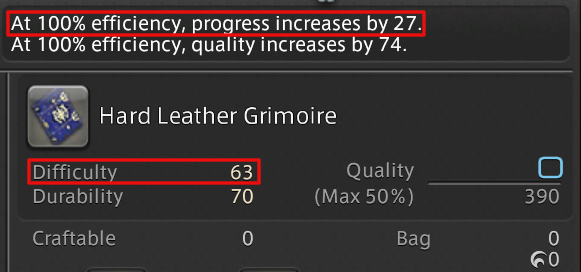

# Final Fantasy 14 Crafting Macros

Crafting macros that have been updated for the Endwalker expansion.


- [Final Fantasy 14 Crafting Macros](#final-fantasy-14-crafting-macros)
  - [Macros by Minimum Level](#macros-by-minimum-level)
  - [Naming Style](#naming-style)
  - [Calculating Progress Multiplier](#calculating-progress-multiplier)
  - [Level 81-ish](#level-81-ish)

## Macros by Minimum Level

Macros are broken down into tiers based on the minimum crafting level in order to use the required skills.  You don't need to create brand new macros every time you learn a new skill.  Instead, you can save time and energy by waiting for key skills.

- [Level 7](Level7CraftingMacros.md)
- [Level 18](Level18CraftingMacros.md)
- [Level 26](Level26CraftingMacros.md)

These macros have been tested out while leveling up an alt, using gear of the appropriate level for the crafts.

## Naming Style

All of the macros are named as follows:

`L7/D50 CP160 2.0x`

- `L7`: The macro uses no skill higher than level 7.  Whether or not it is usable at that level depends on whether your gear has enough CP on it.
- `D50`: The most that durability will be reduced by during the macro.  A macro that only uses 40 durability can be used on all recipes where the item has at least 40 durability.
- `CP160`: The number of CP required to use this macro.  You must have at least this amount of CP to succeed.  
- `2.0x`: How much progress the macro makes.  This is very important, because if you fail to increase the progress bar to 100% then it is a failed synthesis.  It does not hurt to overshoot on progress.

## Calculating Progress Multiplier

In order to calculate which macro to use, it's important to compare the recipe difficulty against your 100% progress increase value.  Divide the difficulty value by the "progress increases by" value and that's the multiplier that you need.  Note that if you are barely reaching the progress multiplier (like "3.0x") then you should plan on using the next higher progress multiplier macro (e.g "4.5x").



## Level 81-ish

Norah gave me this one for use on the level 81 leves / collections.

```
/ac Reflect <wait.3>
/ac Innovation <wait.3>
/ac "Delicate Synthesis" <wait.3>
/ac "Delicate Synthesis" <wait.3>
/ac "Delicate Synthesis" <wait.3>
/ac "Delicate Synthesis" <wait.3>
/ac Innovation <wait.3>
/ac "Delicate Synthesis" <wait.3>
/ac "Delicate Synthesis" <wait.3>
/ac "Delicate Synthesis" <wait.3>
/ac "Delicate Synthesis" <wait.3>
/ac Groundwork <wait.3>
```
